### Hi there 👋

Traveller / NixOS  composer / former VRChat permanent resident.

*Oh-oh I think I’m [addicted](https://www.youtube.com/watch?v=h36GyZ5g1yI), I just can’t get enough* 
*I’m on the brink, it's so predicted but it feels so off the cuff*

---

